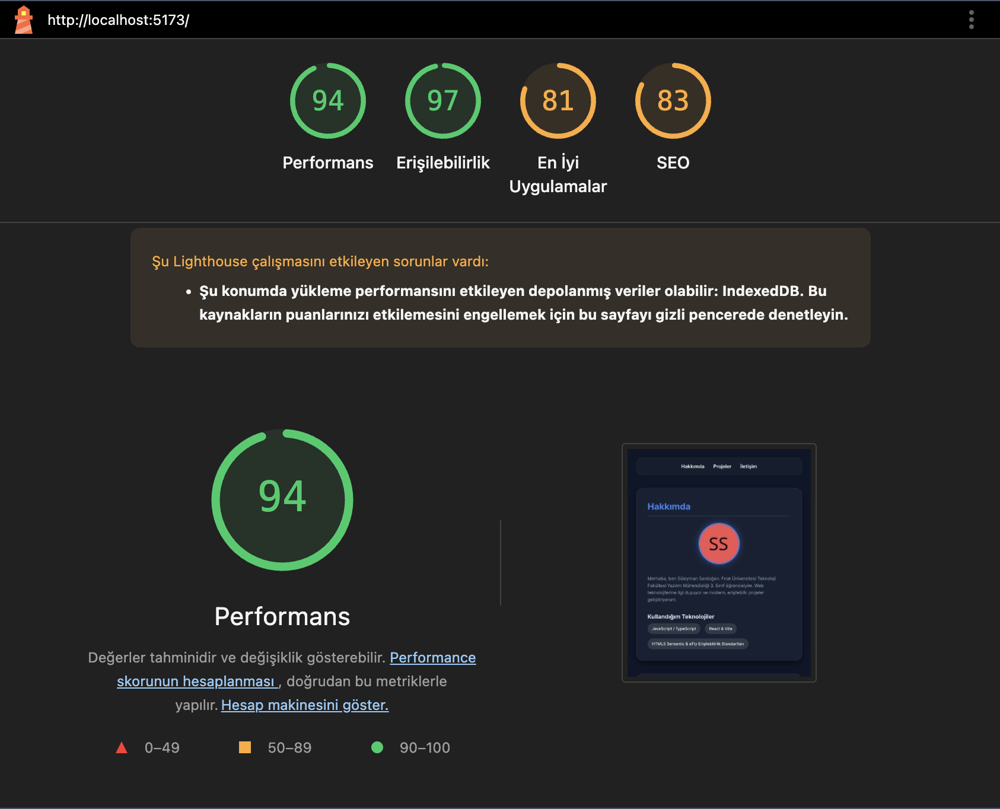

# Fırat Üniversitesi Teknoloji Fakültesi Yazılım Mühendisliği 3. sınıf Dersi Web Tasarım ve Programlama Laboratuvar Çalışmaları
**Süleyman Sardoğan** (220541069)

Bu proje, Web Tasarım ve Programlama laboratuvar dersi kapsamında vite + react kullanılarak geliştirilmiştir.

## Kullanilan Teknolojiler
- React 18
- TypeScript
- Vite

## Kurulum
```bash
npm install
```

## Calistirma
```bash
npm run dev
```
Tarayicida http://localhost:5173 adresini ac.

---

## LAB-1: Kendini Test Et (Sorular ve Cevaplar)

**1. Terminal nedir ve neden GUI yerine terminal kullanılır?**
Terminal, işletim sistemine metin tabanlı komutlar vererek bilgisayarı yönetmemizi sağlayan bir arayüzdür. GUI (Grafiksel Kullanıcı Arayüzü) yerine terminal kullanılmasının sebebi; geliştirme araçlarının ekseriyetle terminal üzerinden çalışıp daha hızlı, daha fazla özelleştirilebilir işlem yapılmasını ve otomasyon süreçlerinin kolaylaştırılmasını sağlamasıdır.

**2. Node.js ne işe yarar? Tarayıcı zaten JavaScript çalıştırıyorsa neden Node.js’e ihtiyacımız var?**
Node.js, JavaScript kodunu tarayıcı (browser) dışında, doğrudan bilgisayar üzerinde (sunucu ortamında) çalıştırabilmemizi sağlayan bir çalışma zamanı (runtime) ortamıdır. Modern web geliştirme araçlarının (Vite, yapılandırma paketleri vb.) birçoğu bilgisayarımızda çalışmak için Node.js ortamına ihtiyaç duyar.

**3. npm ne yapar? package.json dosyasının rolü nedir?**
npm (Node Package Manager), başka geliştiricilerin yazıp paylaştığı hazır kod paketlerini (library) projemize kurmamızı, güncellememizi ve yönetmemizi sağlayan bir paket yöneticisidir. `package.json` ise projenin bir nevi kimlik kartıdır; içerisinde projenin adını, sürümünü, çalıştırılabilir komutları ve en önemlisi ihtiyaç duyduğu paketlerin listesini (dependencies) barındırır.

**4. node_modules klasörü neden GitHub’a yüklenmez?**
`node_modules` binlerce dosya içerir ve boyutu çok büyüktür. `package.json` dosyasında projeye ait hangi paketlerin gerektiği zaten kayıtlı olduğu için; başka biri projeyi indirdiğinde ufak bir kod olan `npm install` komutuyla `node_modules` klasörünü baştan oluşturabilir. Bu yüzden gereksiz uzun boyutlarını sunucuya yüklemekten (.gitignore ile es geçilerek) kaçınılır.

**5. Git’te commit ne demektir? Neden sık sık commit atmalıyız?**
Git'te commit, o anki projedeki dosyaların değişiklik durumunun bir "görüntüsünü (fotoğrafını)" almak ve açıklamasıyla birlikte kaydetmek demektir. Sık sık commit atmalıyız çünkü küçük ve anlamlı adımlarla kaydedilen geliştirmeler geriye dönmeyi (hata anında), geçmişi görüntülemeyi ve hangi aşamada hangi hatanın veya gelişimin yapıldığını takip etmeyi pratik hale getirir.

**6. Branch nedir ve neden doğrudan main üzerinde çalışmıyoruz?**
Branch (dal), ana kod tabanından ayrılıp farklı, bağımsız ve paralel bir çalışma ortamı elde etmemizi sağlar. Doğrudan projelerin çalışan, bitmiş ana dalı olan `main` üzerinde çalışmayız çünkü çalışma esnasında kodları bozabilir veya eksik kayıtlar yapabiliriz. Branch'lar ile ana koda zarar vermeden testler yapılıp daha sonra düzgün çalıştığı kanıtlandığında birleştirme (merge) yapılır.

**7. git add ile git commit arasındaki fark nedir? Stage kavramını açıkla.**
`git add`, çalışma alanımızda değiştirilen dosyaları "Stage (Sahne/Hazırlık Alanı)" adlı ara birime aktarır. Yani "Bir sonraki kaydedişimde bu değişiklikleri dahil edeceğim" demektir. `git commit` ise stage edilmiş bu değişiklerin açıklamayla birlikte Git geçmişinde kalıcı bir "kayıt noktasına" dönüştürülmesini sağlar.

**8. README.md neden önemlidir? İçinde neler olmalıdır?**
README.md projelerin kullanıcılara ve geliştiricilere tanıtıldığı kullanım kitapçığı ya da projenin "vitrini"dir. İçerisinde amaca dair açıklama, kullanılan teknolojiler, kurulum adımları, nasıl çalıştırılacağı, ve geliştirici bilgileri gibi açıklayıcı dokümantasyonlar yer almalıdır.

**9. Vite ne işe yarar? npm run dev komutu arka planda ne yapar?**
Vite, modern web projects çok hızlı bir şekilde ayağa kaldırmamızı sağlayan, anında yenileme (HMR: Hot Module Replacement) özelliğine sahip yeni nesil bir derleme ve proje başlatma (bundling/scaffolding) aracıdır. `npm run dev` komut çalıştırıldığında Vite arka planda projedeki kodları derler, bir geliştirme sunucusu başlatır ve yazdıkça tarayıcının anında güncellenmesini sağlar.

**10. TypeScript ile JavaScript arasındaki temel fark nedir?**
TypeScript, JavaScript'in üzerine "Statik Tip (Type) Denetimi" eklenmiş, kapsayıcı ve gelişmiş bir halidir. JavaScript'te bir değişkenin içerisine sayı konup sonrasında metin aktarılabilirken (esnek yapı), TypeScript buna izin vermez ve nesnelerin tiplerini en baştan belirleyerek hataların tarayıcıda değil henüz kod yazılırken yakalanabilmesini sağlar.

## LAB-2: Lighthouse Erişilebilirlik Raporu

Projede titizlikle uygulanan **Semantik HTML5 etiketleri**, **alt metin kullanımları**, **düzgün heading (başlık) hiyerarşisi**, **iletişim formu label ile role=("alert") mimarisi**, **ARIA (skip-link vs.) öznitelikleri** ve **odaklanma (focus) erişilebilirliği** sayesinde; Google Chrome Lighthouse ölçüm aracında elde edilen **Erişilebilirlik (Accessibility) puanımız 97** olarak kaydedilmiştir. 

Bu yüksek ve eşiksiz skor, portföy web sitemizin ekran okuyucu yazılımları ve aynı zamanda sadece klavye ile (Tab) gezinti üzerinden tüm fonksiyonlarıyla engelsiz bir şekilde rahatça kullanılabileceğini kanıtlamaktadır.


*(Not: Öğrenci Lighthouse ekran görüntüsünü bu isim ile proje dosyalarına ayrıca yükleyecektir)*

---

## LAB-2: Kendini Test Et (Sorular ve Cevaplar)

**1. Semantik HTML ne demektir? `<div>` ile `<section>` arasındaki fark nedir?**
Semantik HTML, kodun sadece görsel yapıyı değil içeriğin anlamını da yansıtmasıdır. `<div>` sadece sayfa düzeni için anlamsız bir kutuyken, `<section>` kendi içinde bir bütünlüğü ve anlamı olan, genellikle bir başlığı olan tematik bölümleri ifade eder.

**2. `<main>` etiketi neden sayfada yalnızca bir kez kullanılmalıdır?**
`<main>` etiketi sayfanın asıl bağımsız ve temel içeriğini temsil eder. Sayfada birden fazla ana içerik ol(a)maz; ayrıca ekran okuyucular için "ana içeriğe atla" gibi kısayolların doğru çalışması için tek bir tane olmalıdır.

**3. Erişilebilirlik (a11y) nedir ve kimler yararlanır?**
Erişilebilirlik (a11y), web içeriklerinin başta görme, işitme veya motor engeli olan bireyler olmak üzere geçici engelli veya yaşlı kullanıcılar da dahil herkes tarafından sorunsuz kullanılabilir olmasıdır.

**4. Heading hiyerarşisinde seviye atlamak neden sorunludur?**
Heading hiyerarşisinde seviye atlamak (örneğin h1'den direkt h3'e geçmek), ekran okuyucuların sayfa yapısını okurken bölüm yapısının kırıldığını düşünmesine sebep olur. Okuyucu için bir kitabın ana bölümünden sonra alt başlık olmadan alt-alt başlığa geçmek gibi mantıksızlaşır.

**5. `alt=""` ile `alt` özniteliğini hiç yazmamak arasındaki fark nedir?**
`alt` özniteliğini hiç yazmamak cihazda/tarayıcıda büyük bir erişilebilirlik hatası (Eksik bilgi) olarak değerlendirilirken; `alt=""` yazılması programcı tarafından bilerek boş bırakıldığı ve içeriğin "sadece dekoratif" olup ekran okuyucu tarafından tamamen es geçilmesi gerektiği anlamına gelir.

**6. ARIA ne zaman kullanılmalıdır? “Altın kuralı” nedir?**
ARIA, HTML ile doğuştan tanımlanamayan ekran davranışlarına ekstra erişilebilirlik bilgisi/durumu eklemek için kullanılır (Örn: özel popup vs). Altın Kural: *"Eğer bir işlemi yapabilen standart (native) bir HTML etiketi varsa, daima ilk olarak o kullanılmalı; ARIA kullanılmamalıdır."*

**7. `<label>` ile form input ilişkisi neden zorunludur? placeholder neden yeterli değildir?**
`<label>` ve `input` ilişkisi, ekran okuyucuların kullanıcılara alanı düzgün okuyabilmesi ve farenin tıklama alanını genişletmek (laba'la tıklanıldığında da inputa odaklanılması) için şarttır. Placeholder kalıcı değildir, metin yazıldığında silinir ve standart ekran okuyucular tarafından okunması tamamen güvenilir değildir.

**8. `required`, `minlength` ve `pattern` öznitelikleri ne işe yarar?**
`required` alanın bilerek boş bırakılamayacağını, `minlength` içine girilen verinin belli bir karakter sınırından uzun olmasını, `pattern` ise içerik girişinin belirli bir "Kurallı İfadeye (RegEX formatına)" uygun olup olmadığını denetler (Örn: şifre standartları).

**9. Tab ile gezinme neden önemlidir? Focus göstergesi neden kaldırılmamalıdır?**
Motor engelinden dolayı fare kullanamayan kişiler sayfada bağlantılar arası geçişleri sadece "Tab" tuşuyla sağlar. Focus (odak) işaretinin (dış kenarlıkların) kaldırılması, kullanıcının o an hangi butonda olduğunu görememesine ve bu yüzden sitenin klavye ile kullanılamaz hale gelmesine yol açar.

**10. Lighthouse erişilebilirlik puanı 100 olması, sitenin tamamen erişilebilir olduğu anlamına gelir mi?**
Hayır. Lighthouse ve benzer araçlar yalnızca algoritmik ve otomatik kuralları (renk kontrastı, alt etiketlerin varlığı, labellar vb.) belirler. Gerçek insan deneyimine veya kompleks özel cihazlara yönelik tüm spesifik senaryoları ölçemeyeceği için manuel (insanlı) ekran okuyucu testi her zaman gereklidir.
